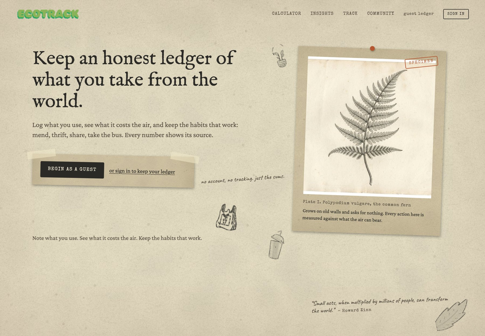
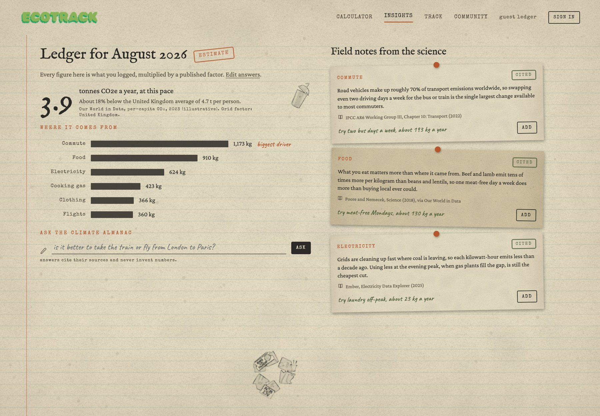
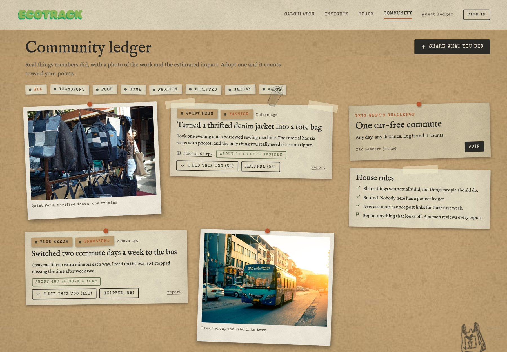

# EcoTrack

An honest ledger of what you take from the world, and the habits worth keeping.

EcoTrack helps people see what their everyday choices cost the air, in numbers that show their sources, then nudges them toward the habits that actually help: mend, thrift, share, take the bus. It began as a first-year carbon calculator and is being rebuilt as a community tool against over-consumption and fast fashion.



## What it does

- **Calculator.** Log a typical week: commute, home energy, food, flights, and the clothes you buy. Every line is quantity × a published emission factor, with the factor set and grid source named on the page. Distances and gas can be entered in local units; the engine stays metric underneath.
- **Insights.** A breakdown of where the footprint comes from, a comparison with your country's average, and field notes from the Climate Almanac, each one cited.
- **Track.** Month by month progress compared with your own baseline, never with strangers. Points only ever go up.
- **Community.** Real things members did, with a photo of the work and the estimated impact. Adopt an action and it counts toward your points.
- **Character.** Members appear as a chosen character. Email and login never show anywhere.

<p align="center">
  
  
</p>

## Run it

Copy `.env.example` to `.env` and fill in the Neon values (database URL, Auth URL, a random cookie secret). The site works as a guest without them; sign-in needs them.

```bash
npm install
npm run dev        # http://localhost:3000
```

`npm test` runs the engine tests, `npm run lint` runs ESLint, and `npm run build` produces the production build.

The current build runs on mock data and a pure calculation engine; accounts, storage, and the real factor sets come next.

## License

MIT
